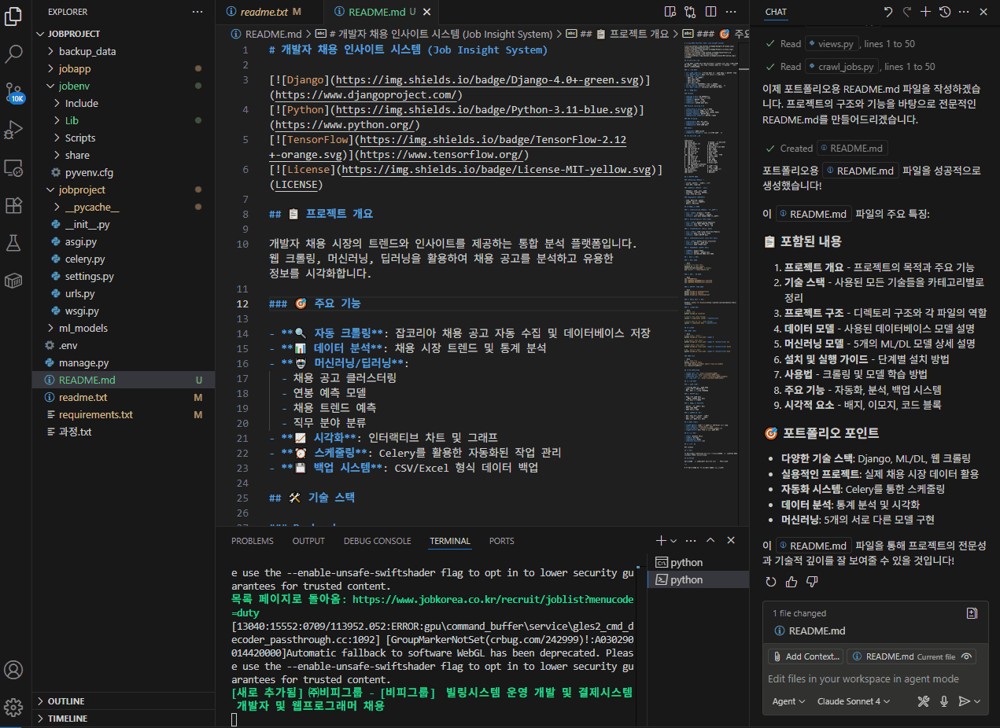

# 개발자 채용 인사이트 시스템 (Job Insight System)

[](https://www.djangoproject.com/)
[](https://www.python.org/)
[](https://www.tensorflow.org/)
[](https://selenium.dev/)
[](https://scikit-learn.org/)
[](https://www.mysql.com/)
[](https://redis.io/)
[](https://docs.celeryq.dev/)
[](LICENSE)

## 📋 프로젝트 개요

개발자 채용 시장의 트렌드와 인사이트를 제공하는 통합 분석 플랫폼입니다. 웹 크롤링, 머신러닝, 딥러닝을 활용하여 채용 공고를 분석하고 유용한 정보를 시각화합니다.

## 🎥 시연 영상

### 메인 페이지 및 인사이트 분석


### 크롤링 및 데이터 수집



### 🎯 주요 기능

- **🔍 자동 크롤링**: 잡코리아 채용 공고 자동 수집 및 데이터베이스 저장
- **📊 데이터 분석**: 채용 시장 트렌드 및 통계 분석
- **🤖 머신러닝/딥러닝**:
  - 채용 공고 클러스터링
  - 연봉 예측 모델
  - 채용 트렌드 예측
  - 직무 분야 분류
- **📈 시각화**: 인터랙티브 차트 및 그래프
- **⏰ 스케줄링**: Celery를 활용한 자동화된 작업 관리
- **💾 백업 시스템**: CSV/Excel 형식 데이터 백업

## 🛠️ 기술 스택

### Backend

- **Django 4.0+**: 웹 프레임워크 
- **Python 3.11**: 메인 개발 언어 
- **MySQL**: 데이터베이스 
- **Redis**: 메시지 브로커 
- **Celery**: 비동기 작업 처리 

### Machine Learning & AI

- **TensorFlow 2.12+**: 딥러닝 모델 
- **Scikit-learn**: 머신러닝 알고리즘 
- **Transformers**: 자연어 처리 (Gemma 모델) 
- **NumPy, Pandas**: 데이터 처리  
- **Matplotlib, Seaborn**: 데이터 시각화  

### Web Scraping

- **Selenium**: 동적 웹 크롤링 
- **Beautiful Soup**: HTML 파싱 
- **Requests**: HTTP 요청 처리 

### Others

- **Joblib**: 모델 직렬화 
- **WebDriver Manager**: 크롬 드라이버 자동 관리 

## 🏗️ 프로젝트 구조

```
Jobproject/
├── manage.py                 # Django 관리 스크립트
├── requirements.txt          # 의존성 패키지
├── readme.txt               # 실행 가이드
├── jobproject/              # Django 프로젝트 설정
│   ├── settings.py          # 환경 설정
│   ├── urls.py              # URL 라우팅
│   ├── celery.py            # Celery 설정
│   └── wsgi.py              # WSGI 설정
├── jobapp/                  # 메인 애플리케이션
│   ├── models.py            # 데이터 모델
│   ├── views.py             # 뷰 로직
│   ├── urls.py              # URL 매핑
│   ├── ml_models.py         # ML/DL 모델
│   ├── tasks.py             # Celery 작업
│   ├── management/commands/
│   │   └── crawl_jobs.py    # 크롤링 명령
│   └── templates/           # HTML 템플릿
├── ml_models/               # 저장된 모델 파일
├── backup_data/             # 백업 데이터
└── jobenv/                  # 가상환경
```

## 📊 데이터 모델

### JobPosting (채용공고)

- 회사명, 직무명, 고용형태, 근무지
- 상세 URL, 생성일자

### JobDetail (채용공고 상세)

- 모집분야, 직종, 직급, 직책
- 상세요강, 주요업무, 필요스킬
- 경력, 학력 요구사항

### CompanyInfo (기업정보)

- 업종, 기업규모, 자본금
- 직원수, 매출액, 평균연봉
- 설립일, 웹사이트

## 🤖 머신러닝 모델

### 1. JobClustering (채용공고 클러스터링)

- **알고리즘**: K-means + TF-IDF
- **목적**: 유사한 채용공고 그룹화
- **특징**: 직무 설명 텍스트 기반 클러스터링

### 2. SalaryPredictor (연봉 예측)

- **알고리즘**: Random Forest Regressor
- **목적**: 직무 조건 기반 연봉 예측
- **특징**: 경력, 학력, 지역 등 고려

### 3. TrendPredictor (트렌드 예측)

- **알고리즘**: LSTM (Long Short-Term Memory)
- **목적**: 채용 시장 트렌드 예측
- **특징**: 시계열 데이터 분석

### 4. JobFieldClassifier (직무 분야 분류)

- **알고리즘**: Random Forest Classifier
- **목적**: 채용공고 자동 분류
- **특징**: 다중 클래스 분류

### 5. GemmaModel (자연어 처리)

- **모델**: Google Gemma
- **목적**: 채용공고 텍스트 분석
- **특징**: 트랜스포머 기반 언어 모델

## 🚀 설치 및 실행

### 1. 환경 설정

```bash
# Python 3.11 설치 필요
python3.11 -m venv jobenv
jobenv\Scripts\activate  # Windows
pip install -r requirements.txt
```

### 2. 환경 변수 설정

```bash
set PYTHONUTF8=1
set JOBKOREA_USERNAME=your_username
set JOBKOREA_PASSWORD=your_password
```

### 3. 데이터베이스 설정

```bash
python manage.py makemigrations
python manage.py migrate
python manage.py createsuperuser
```

### 4. Redis 설치 및 실행

Windows: [Redis for Windows](https://github.com/tporadowski/redis/releases)

### 5. 서비스 실행

```bash
# Django 서버
python manage.py runserver

# Celery 워커 (별도 터미널)
celery -A jobproject worker --loglevel=info

# Celery Beat 스케줄러 (별도 터미널)
celery -A jobproject beat --loglevel=info
```

## 📈 사용법

### 크롤링 실행

```bash
# 기본 크롤링 (3페이지)
python manage.py crawl_jobs --pages 3

# CSV 백업과 함께 크롤링
python manage.py crawl_jobs --pages 5 --backup-format csv

# Excel 백업과 함께 크롤링
python manage.py crawl_jobs --pages 5 --backup-format excel

# 모든 형식으로 백업
python manage.py crawl_jobs --pages 5 --backup-format both
```

### 모델 학습

```bash
# 모든 모델 학습
python manage.py shell
>>> from jobapp.ml_models import train_all_models
>>> train_all_models()
```

## 🌐 웹 인터페이스

- **메인 페이지**: `http://localhost:8000/`
- **채용 목록**: `http://localhost:8000/jobs/`
- **인사이트 페이지**: `http://localhost:8000/insights/`
- **관리자 페이지**: `http://localhost:8000/admin/`

## 📊 주요 기능

### 1. 자동 크롤링

- 잡코리아 채용 공고 자동 수집
- 중복 제거 및 데이터 정제
- 에러 처리 및 재시도 메커니즘

### 2. 데이터 분석

- 채용 시장 통계 분석
- 지역별, 직종별 분포 분석
- 연봉 분석 및 시각화

### 3. 머신러닝 인사이트

- 채용공고 클러스터링 결과
- 연봉 예측 모델
- 채용 트렌드 예측

### 4. 자동화 스케줄링

- 매일 새벽 2시: 3페이지 크롤링
- 매주 일요일: 10페이지 크롤링
- 매월 1일: 백업 파일 정리

## 💾 백업 시스템

- **자동 백업**: 크롤링 시 자동으로 CSV/Excel 파일 생성
- **파일 위치**: `backup_data/` 폴더
- **파일명 형식**: `job_data_YYYYMMDD_HHMMSS.csv`
- **자동 정리**: 30일 이상 된 파일 자동 삭제

## 🔧 개발 환경

- **OS**: Windows 10/11
- **IDE**: VS Code
- **Database**: MySQL
- **Version Control**: Git

## 📝 라이선스

MIT License

## 🤝 기여

이 프로젝트는 포트폴리오 목적으로 개발되었습니다. 개선사항이나 버그 리포트는 이슈로 등록해주세요.

## 📧 연락처

프로젝트에 대한 문의사항이 있으시면 언제든지 연락주세요.

---

⭐ 이 프로젝트가 도움이 되었다면 스타를 눌러주세요!
